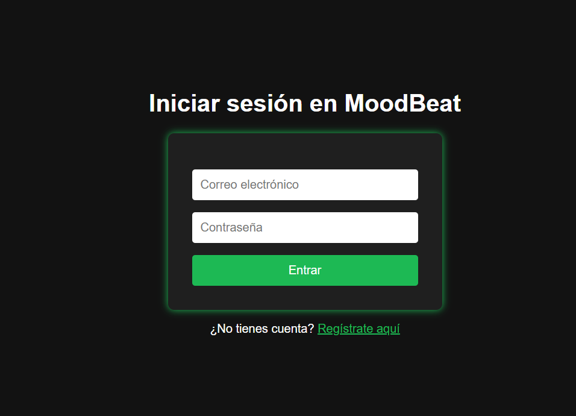
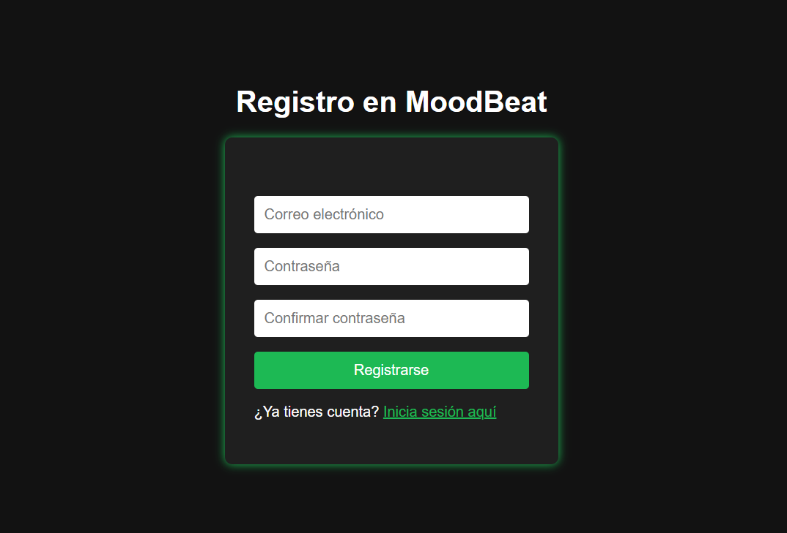
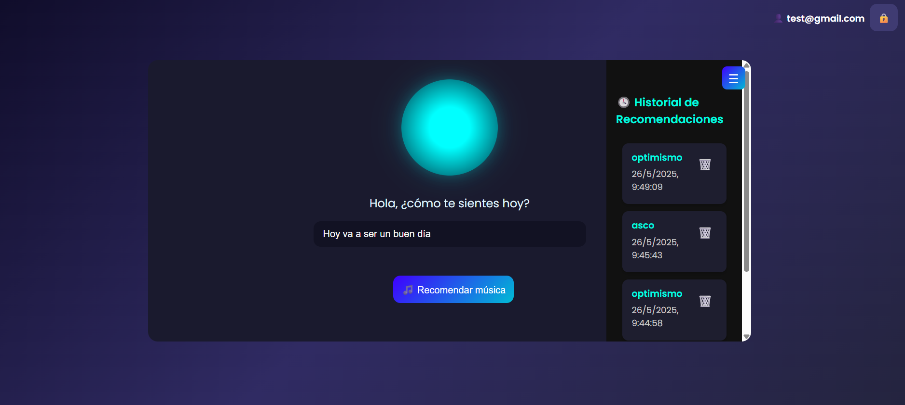
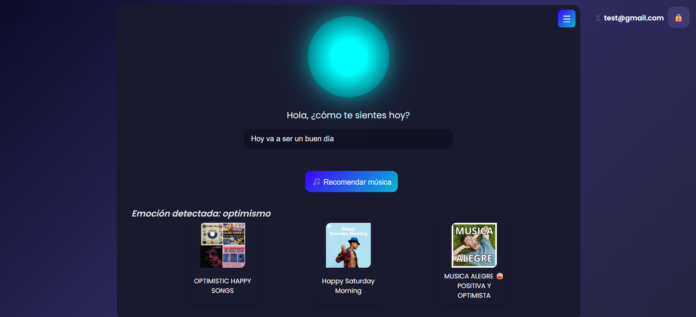
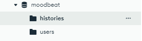
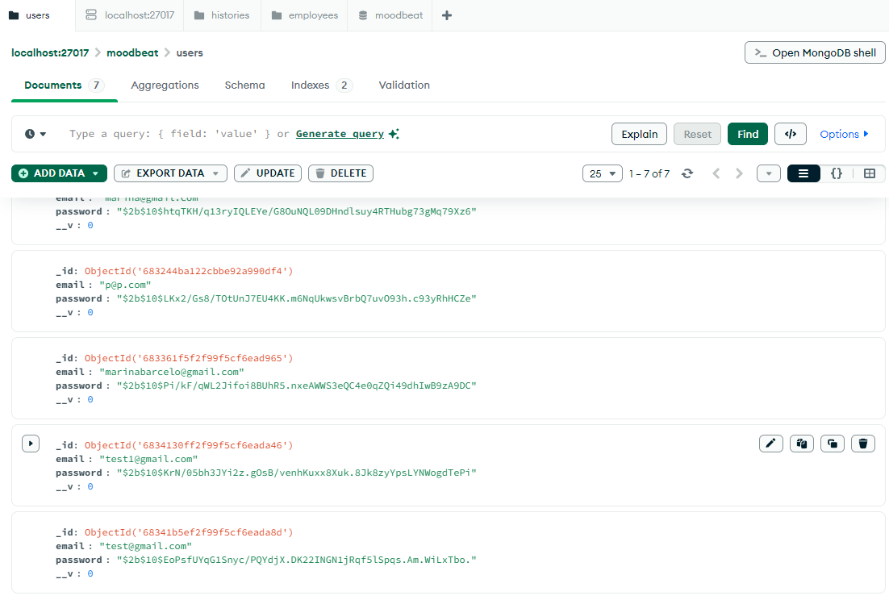

# 🎶 MoodBeat Assistant

**MoodBeat Assistant** es una aplicación web que detecta tu estado de ánimo a partir de texto y te recomienda música acorde utilizando inteligencia artificial y APIs musicales. 

---

## 🧠 ¿Cómo Funciona?

1. El usuario escribe cómo se siente.
2. Un modelo de IA (Flask) analiza el texto y detecta la emoción.
3. Basado en esa emoción, se consultan playlists sugeridas desde un backend (Node.js).
4. El usuario puede escuchar la música recomendada y consultar su historial de emociones y playlists.

---

## 🌐 Demo

[🎥 Ver video demo](./videoDemo/Demo.mp4)


---

## 📦 Tecnologías Utilizadas

| Capa           | Tecnología         | Descripción                                  |
| -------------- | ------------------ | -------------------------------------------- |
| Frontend       | HTML, CSS, JS      | Interfaz de usuario                          |
| Backend API    | Node.js + Express  | Registro, login, historial, recomendación    |
| IA Emocional   | Python + Flask     | Detección de emoción desde texto             |
| Almacenamiento | MongoDB Atlas      | Base de datos para usuarios e historial      |
| Otros          | JWT, GSAP, Spotify | Autenticación, animaciones y música embebida |

---

## 🗃️ Estructura del Proyecto

```
MoodBeat-Assistant/
│
├── backend-node/        # API REST con Node.js (usuarios, historial, recomendaciones)
├── backend-flask/       # API Flask (detección de emociones desde texto)
├── frontend/            # HTML + CSS + JS puro para la interfaz
├── videoDemo/           # VideoDemo
├── README.md            # Este archivo
└── .env.example         # Variables de entorno de ejemplo
```

---

## ⚙️ Instalación y Ejecución

### 🔧 Requisitos Previos

* Node.js >= 18
* Python >= 3.9
* MongoDB (se recomienda MongoDB Atlas)
* Git

---

### 🚀 Pasos para correr localmente

#### 1. Clona el repositorio

```bash
git clone https://github.com/tu-usuario/MoodBeat-Assistant.git
cd MoodBeat-Assistant
```

---

#### 2. Configura variables de entorno

* Renombra `.env.example` a `.env` en `backend-node/` y agrega tus valores de MongoDB, claves JWT, y la URL del backend Flask.

---

#### 3. Instala y corre el backend Node.js

```bash
cd backend-node
npm install
node app.js
```

Esto levanta el servidor Node en `http://localhost:3000`.

---

#### 4. Instala y corre el backend Flask

```bash
cd ../backend-flask
python -m venv venv
source venv/bin/activate  # o venv\Scripts\activate en Windows
pip install -r requirements.txt
python app.py
```

Esto levanta el servidor Flask en `http://localhost:5000`.

---

#### 5. Abre el frontend

```bash
cd ../frontend
# Abre login.html con tu navegador
```

---

## ✅ Estado Actual

* [x] Registro e inicio de sesión
* [x] Detección emocional desde texto
* [x] Recomendaciones musicales personalizadas
* [x] Historial de uso por usuario
* [x] Interfaz moderna y responsiva

---

## 🖼️ Capturas de Pantalla

### Página de Login


### Registro de Usuario


### Página Principal


### Historial de Emociones


### Recomendaciones


### Recomendacion Spotify


### MongoDB


### MongoDB Users


### MongoDB Historial


